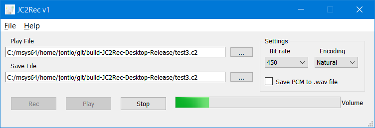

# JC2Rec is a GUI in Qt for recording speech using Codec2

[Codec2] is an audio compression codec designed for speech. The codec is designed for very high compression ratios. It has bit rates as low as 450 bits per second!!!

I wrote this application to make audio recordings with this audio compressor.

For more information see https://jontio.zapto.org/hda1/jc2rec.html

### Building

You will need the [codec2 repo] cloned into a directory above the jc2rec repo. You'll have to build codec2 and have all the required QT things. On Windows I suggest using [MSYS2] to install everything needed.

Jonti 
2021

[Codec2]: http://www.rowetel.com/wordpress/?page_id=452
[codec2 repo]: https://github.com/drowe67/codec2
[MSYS2]: https://www.msys2.org/